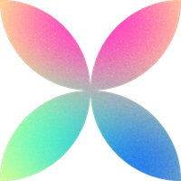

# dragndrop

_italique_ s'affiche ainsi : italique

**gras** s'affiche ainsi : gras

**_gras-italique_** s'affiche ainsi : gras-italique

~~barré~~ s'affiche ainsi : barré

---
**Plan possible:**
1. Un Court descriptif de votre idée
2. Captures d'écran des étapes du projet (chronologie +dates)
3. Focus (points de détails du projet : code, image...)
4. La structure du projet (navigation, pages...)
5. Bonjour