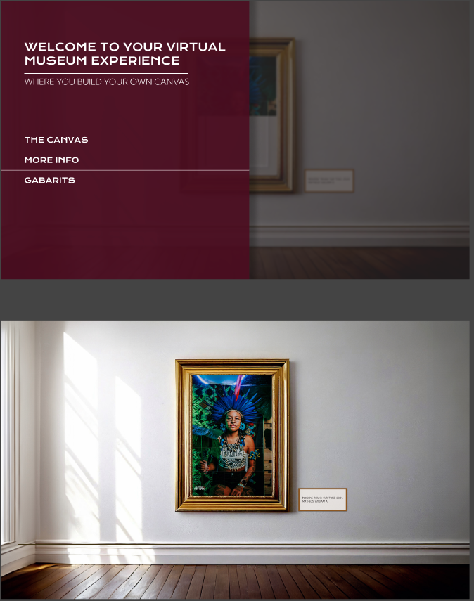

# dragndrop

_italique_ s'affiche ainsi : italique

**gras** s'affiche ainsi : gras

**_gras-italique_** s'affiche ainsi : gras-italique

~~barré~~ s'affiche ainsi : barré

---
**Le Projet:**
1. L'idée de ce projet est de créer une expérience immersive en ligne pour un musée virtuel où les utilisateurs peuvent s'amuser tout en montants leurs propres tableaux dans un style de puzzle. Le concept repose sur l'interaction avec l'art et l'engagement du public dans un espace numérique qui fusionne l'art et le jeu.
2. 
3.[Lien figma](https://www.figma.com/design/sZ8jLicQA2RaxPAMk7D7X3/Rendu-2---Museum-Experience---Ana-Clara-Dos-Santos-Souza?node-id=0-1&t=AQ7HW4OMdVMwIiGi-1)